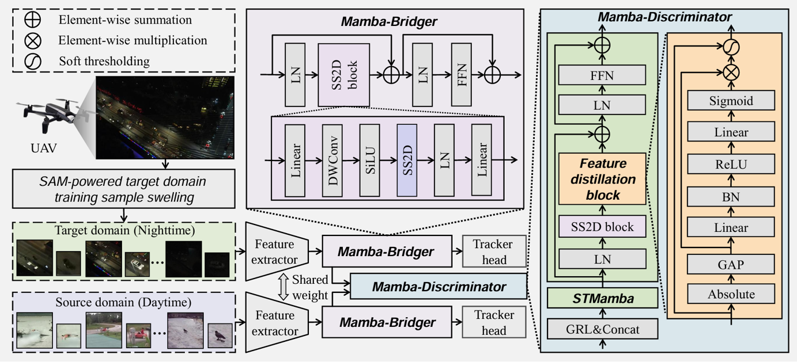
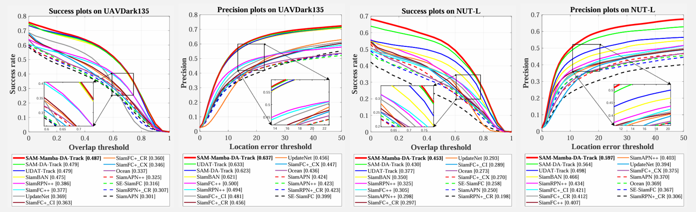
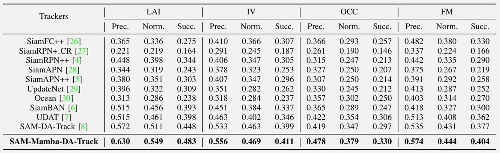
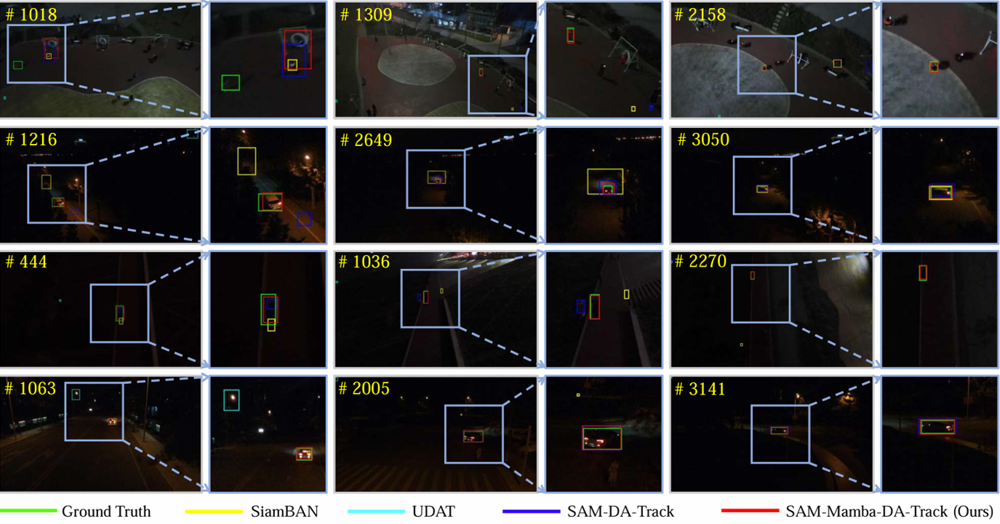
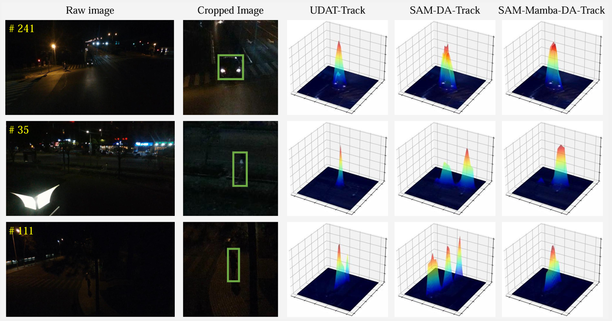
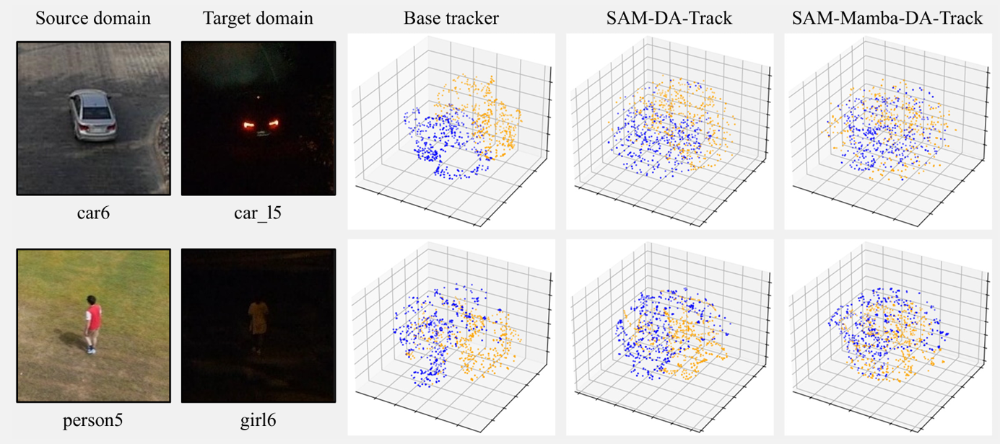

# SAM-Mamba-DA: SAM-Mamba Domain Adaptation for Nighttime UAV Tracking


Liangliang YaoChanghong Fu*, Haobo Zuo,  Yiheng Wang, Geng Lu

* \* Corresponding author. 

**[Vision4robotics](https://vision4robotics.github.io/)**


## 🏗️ Framework


## :chart_with_upwards_trend: Performance
* **Benchmark evaluation**

  

* **Attribute-based performance**

  

## 👀 Visualization of SAM-Mamba-DA
* **Comparison of tracking results**

  

* **Comparison of heatmap**

  

* **Feature visualization by [t-SNE](https://opentsne.readthedocs.io/en/latest/index.html)**

  

## 🛠️ Installation

This code has been tested on Ubuntu 18.04.6 LTS, Python 3.9.21, Pytorch 2.5.1, and CUDA 12.0. Please install related libraries before running this code:

* Install SAM-DA-Track:

    ```
    pip install -r requirements.txt
    ```

## 😀 Getting started
### Test SAM-DA
* Download a **model checkpoint** below and put it in `./snapshot`.

  | Model | Source 1 | Source 2 | 
  | ----  |  ----  | ----  | 
  |  SAM-Mamba-DA |  [Baidu](https://pan.baidu.com/s/1t4U5Jvh8uZxzaIvH17bCuw?pwd=wq7v)  | [Dropboxs]() to be soon  |
  
* Download NUT-L dataset and UAVDark135

  | Dataset | Source 1 | Source 2 | 
  | ----  |  ----  | ----  | 
  |  UAVDark135 |  [Baidu](https://pan.baidu.com/s/16JfGA5xvwT4bNtUidsgMmQ?pwd=5s58)  | [Dropbox]()  to be soon |
  |  NUT-L |  [Baidu](https://pan.baidu.com/s/1KWYp5UHflFuaPiWLFZvaKw?pwd=t4tr)  | [Dropbox]()  to be soon |


* Put these datasets in `./test_dataset`.
* Test and evalute on NUT-L with `default` settings. 

    ```bash
    conda activate <your env>
    export PYTHONPATH=$(pwd)
    python tools/test.py 
    python tools/eval.py
    ```


### Train SAM-DA
* SAM-powered target domain training sample swelling on NAT2021-*train*.

  Please refer to [SAM-DA](https://github.com/vision4robotics/SAM-DA) for preparing the nighttime training dataset.

* Prepare daytime dataset [VID] and [GOT-10K].
  1. Download [VID](https://image-net.org/challenges/LSVRC/2017/) and [GOT-10K](http://got-10k.aitestunion.com/downloads) and put them in `./tracker/BAN/train_dataset/vid` and `./tracker/BAN/train_dataset/got10k`, respectively.
  2. Crop data following the instruction for [VID](./train_dataset/vid/readme.md) and [GOT-10k](./train_dataset/got10k/readme.md).

* Train `sam-da-track-b` (default) and other models. 
  ```bash
  conda activate <your env>
  export PYTHONPATH=$(pwd)
  python tools/train.py 
  ```


# License
The model is licensed under the Apache License 2.0 license.

# Citations
Please consider citing the related paper(s) in your publications if it helps your research.
```
@Inproceedings{Yao2023SAMDA,
  title={{SAM-DA: UAV Tracks Anything at Night with SAM-Powered Domain Adaptation}},
  author={Fu, Changhong and Yao, Liangliang and Zuo, Haobo and Zheng, Guangze and Pan, Jia},
  booktitle={Proceedings of the IEEE  International Conference on Advanced Robotics and Mechatronics (ICARM)},
  year={2024}
  pages={1-8}
}
@article{kirillov2023segment,
  title={{Segment Anything}},
  author={Kirillov, Alexander and Mintun, Eric and Ravi, Nikhila and Mao, Hanzi and Rolland, Chloe and Gustafson, Laura and Xiao, Tete and Whitehead, Spencer and Berg, Alexander C and Lo, Wan-Yen and others},
  journal={arXiv preprint arXiv:2304.02643},
  year={2023}
  pages={1-30}
}
@Inproceedings{Ye2022CVPR,
title={{Unsupervised Domain Adaptation for Nighttime Aerial Tracking}},
author={Ye, Junjie and Fu, Changhong and Zheng, Guangze and Paudel, Danda Pani and Chen, Guang},
booktitle={Proceedings of the IEEE/CVF Conference on Computer Vision and Pattern Recognition (CVPR)},
year={2022},
pages={1-10}
}
```
# Acknowledgments
We sincerely thank the contribution of following repos: [SAM](https://github.com/facebookresearch/segment-anything), [SiamBAN](https://github.com/hqucv/siamban), [UDAT](https://github.com/vision4robotics/UDAT), [SAM-DA](https://github.com/vision4robotics/SAM-DA).

# Contact
If you have any questions, please contact Liangliang Yao at [1951018@tongji.edu.cn](mailto:1951018@tongji.edu.cn) or Changhong Fu at [changhongfu@tongji.edu.cn](mailto:changhongfu@tongji.edu.cn).
